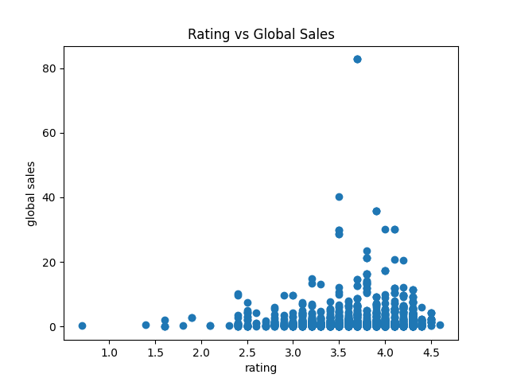
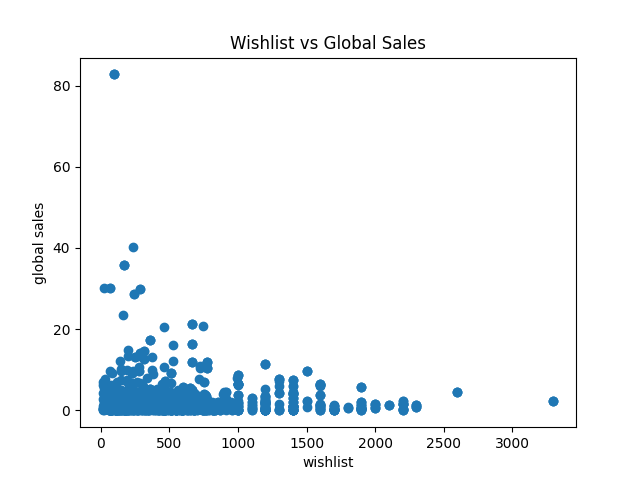
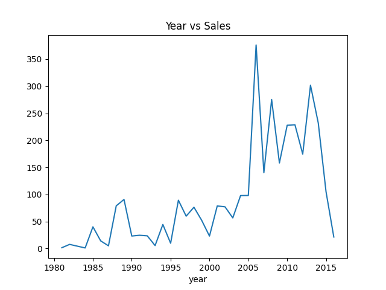
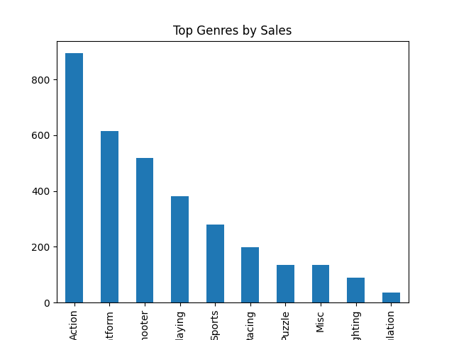

# 🎮 Video Game Analysis Dashboard

## 📌 Project Overview
This project analyzes video game sales and engagement data using Python, MySQL, Power BI, and Streamlit.  
It provides insights into game popularity, user behavior, and platform performance.

---

## 🚀 Features
- Data Cleaning & Merging  
- SQL Data Analysis  
- Exploratory Data Analysis (EDA)  
- Power BI Dashboard  
- Streamlit Interactive App  

---

## 📊 Power BI Dashboard

### 🔍 Preview


### 🌐 Live Dashboard
👉 [View Dashboard](https://app.powerbi.com/view?r=YOUR_LINK)

### 📄 PDF Report
👉 [Download Dashboard](Dashboard.pdf)

---

## 📈 EDA Visualizations

### ⭐ Rating vs Sales


### 💖 Wishlist vs Sales


### 📅 Sales Trend Over Years


### 🎯 Top Genres


---

## 🏆 Top Rated Games

| Game Name | Rating |
|----------|--------|
| Game A | 4.8 |
| Game B | 4.7 |
| Game C | 4.6 |
| Game D | 4.5 |

👉 (Replace with your actual top games from dataset)

---

## 📈 Key Insights

- ⭐ Higher rated games show better engagement  
- 💖 Wishlist strongly correlates with global sales  
- 🎯 Action and Adventure genres dominate  
- 🌍 North America has highest sales  
- 🎮 Few platforms generate most revenue  

---

## 📂 Dataset Description

### Dataset 1: Games Data
- Title  
- Rating  
- Wishlist  
- Backlogs  
- Plays  

### Dataset 2: VG Sales Data
- Name  
- Platform  
- Year  
- Global Sales  
- Regional Sales  

---

## 🛠️ Tech Stack
- Python (Pandas, Matplotlib)
- MySQL
- Power BI
- Streamlit

---

## ▶️ Run the Project

```bash
streamlit run app.py
